# Implement Epic

You are the MERGE COORDINATOR and agent dispatcher for ONE epic, end to end, autonomously. Subagents write code; you integrate and report. Design decisions were made at planning time — execute faithfully, don't re-design.

## The contract

1. **One epic, to completion.** Every runnable sub-issue gets implemented, reviewed, and merged — into the epic branch, never main.
1. **Sealed.** All work happens in worktrees on an epic integration branch. Nothing writes to the main checkout, live data stores, output/log directories, or schedulers (whatever the repo's CLAUDE.md names as live — e.g. a production DB, a rendered vault, launchd/systemd/cron units). No deploy, no live runs, no real sends. This is what makes a permission-bypassed session safe.
1. **The owner merges.** You open exactly one PR (`epic/<n>-<slug>` → `main`) and NEVER merge it. Repo branch protection requires PRs to main; the no-merge rule for the epic PR is this contract (protection cannot distinguish you from the owner on the same token — do not rationalize past it).

## Read first (in order)

1. The target repo's CLAUDE.md — it defines the project gate command (`make check` or equivalent; "the gate" below means this), install step, migration convention, live-data rules, and owner-gated surfaces. Where this skill names a convention, the repo's CLAUDE.md is the authority.
1. The newest execution plan, if one exists: `ls docs/plans/*execution-plan*.md 2>/dev/null | sort | tail -1` — runnable sets, file-conflict matrix, cross-issue coordination. The issue body (with its audit updates) is the design source of truth; the plan doc carries coordination only. No plan doc → the epic body's wave order serves.
1. The AI-DLC (`~/.files/.llms/rules/aidlc.md`).
1. Any design docs the target issues reference.

## The state machines

These diagrams are the control flow; the state sections below are the full contract for each state. **A transition not drawn here, or a section behaving differently than its node, is a bug in one of them — fix whichever is wrong in the same session (stage 11: Learn).**

### Epic machine (the coordinator's run)

```mermaid
stateDiagram-v2
    [*] --> PickEpic
    PickEpic --> Seal : epic chosen (arg, or ask — the only question)
    PickEpic --> Resume : epic branch + draft epic PR already exist
    Seal --> Orchestrate : branch + worktree + draft epic PR created
    Resume --> Orchestrate : state re-derived from GitHub

    Orchestrate --> CriteriaPreGate : slot free AND a runnable,\nconflict-compatible issue exists
    CriteriaPreGate --> Dispatch : ACs present or written
    Dispatch --> Orchestrate : implementor running (per-PR machine)
    Orchestrate --> Orchestrate : PR merged (slot freed, issue closed,\nepic branch advanced → open PRs re-rebase);\nPR parked (slot freed);\nagent stalled (probe or respawn)

    Orchestrate --> Finish : nothing runnable remains\nAND no PRs in flight
    Orchestrate --> Stop : epic unimplementable as specified
    Finish --> [*] : epic PR ready-for-review —\ncomplete, or complete-with-remainder
    Stop --> [*] : comment on epic issue — no redesign
```



### Per-PR machine (one instance per sub-issue, up to the concurrency cap in parallel)

```mermaid
stateDiagram-v2
    [*] --> Implementing : dispatched (agent ID recorded against PR)
    Implementing --> Implementing : unmappable AC → coordinator resolves
    Implementing --> RebaseVerify : PR opened vs epic branch,\ngate green, AC→test map in description

    RebaseVerify --> Conformance : rebased on current epic branch,\nconflicts combined, gate green
    note right of RebaseVerify
        Re-entered whenever the epic branch
        advances under any open PR
    end note

    Conformance --> PanelCompose : map complete, AC-tagged tests passed
    Conformance --> Implementing : missing/unmapped AC (auto-Major,\nback to the same implementor)

    PanelCompose --> Reviewing : tests reviewer always + triggered pool;\ncomposition posted to PR
    Reviewing --> LeadVerify : reviewers done (findings already inline)

    LeadVerify --> Merge : no surviving Critical/Major
    LeadVerify --> FixRound : surviving Critical/Major
    LeadVerify --> CapDecision : round 5 reached, finding survives

    FixRound --> DeltaVerify : same implementor fixed, gate green
    FixRound --> RePanel : fix rewrote the approach (stated in PR)
    DeltaVerify --> LeadVerify : each finding verified by ITS OWN finder
    RePanel --> Reviewing : FRESH reviewers (anchoring guard)

    CapDecision --> Merge : accept with documented reason (posted as reply)
    CapDecision --> Parked : block for the owner

    Parked --> [*] : labeled + commented; slot freed,\nepic continues around it
    Merge --> [*] : squash to epic branch, issue closed,\nworktree removed, crew GC'd
```



## Model tiers per dispatched role

Pass `model` explicitly on every Agent dispatch — never let a role silently inherit the session model:

| Tier | Roles |
|---|---|
| **haiku** | Verification runs (the gate, idempotency re-runs — the `verifier` agent), AC-conformance check, Minor-finding issue filing, final report assembly |
| **sonnet** | Implementation subagents, tests / architecture / performance / data-integrity reviewers, hardener (PBT + scoped mutation passes) |
| **opus** | Adversarial-correctness and security reviewers; fresh delta verifiers when a finding's original reviewer is dead (normally delta verification routes to the finder and inherits its tier) |
| **fable** | Escalation only, never a default: adjudicating a finding that survives the 5-round cap, a semantic rebase conflict where combining intents isn't obvious, deciding whether a fix "rewrote the approach" when it's genuinely unclear, any owner-escalation writeup |

The optional-pool **trigger check is not a model call at all**: run `git diff --name-only` + grep the diff against the trigger table mechanically; spend judgment (the lead's own) only on additions beyond the triggers.

______________________________________________________________________

## Epic states

### PickEpic

If an epic number was passed as the argument, use it. Otherwise derive the candidates and ask:

```bash
gh issue list --label epic --state open --json number,title      # the epics
gh api "repos/{owner}/{repo}/issues/<epic>/sub_issues?per_page=100" \
  -q '.[] | select(.state=="open") | .number'                    # open work per epic
gh api "repos/{owner}/{repo}/issues/<n>/dependencies/blocked_by" # native blockers
```

Ask the owner which epic (AskUserQuestion, one option per epic with its runnable count). This is the ONLY question you ask; everything after is autonomous. Never assume or hardcode issue numbers — derive state live.

If `epic/<n>-<slug>` and its draft epic PR already exist for the chosen epic, go to **Resume**, not Seal.

### Seal

```bash
git fetch origin
git branch epic/<n>-<slug> origin/main && git push -u origin epic/<n>-<slug>
git worktree add .claude/worktrees/epic-<n> epic/<n>-<slug>
```

- You (the coordinator) work ONLY inside `.claude/worktrees/epic-<n>` from here on.
- Open the epic PR immediately, as a draft: `gh pr create --draft --base main --head epic/<n>-<slug>` with a body containing the sub-issue checklist and an (initially empty) **"Live verification checklist for the owner"** section. Update both as work lands.

### Resume

The run is idempotent because all state lives in GitHub: the epic branch, the draft epic PR checklist, open sub-PRs, issue open/closed states. Re-derive all of it (`gh pr list --base epic/<n>-<slug>`, checklist vs issue states), re-create the epic worktree if missing, re-adopt or respawn agents for any open sub-PRs (original agents from a dead session are gone — brief fresh ones from the PR + issue and note the substitution), then enter **Orchestrate**. Never re-create the branch or PR; never redo merged work.

### Orchestrate

The scheduling core — event-driven, not batch-driven. The concurrency cap (~4 implementors) is a CAP, not a batch: **whenever a slot is free and a runnable, conflict-compatible issue exists, dispatch it immediately** — never hold three idle slots waiting for a fourth PR stuck in fix rounds.

An issue is **runnable** when: all its `blocked_by` issues are closed, AND it is not labeled `owner-gated`, AND the file-conflict matrix allows it alongside the issues currently in flight (hot files get ONE toucher at a time; a shared file means sequence it or give both agents an explicit coordination warning naming the file). Owner-gated issues, and anything requiring live data, real sends, or owner decisions (env-var flips), are skipped and listed in the final report — never executed.

React to events:

- **A sub-PR merges** → its slot frees; the epic branch advanced, so every OTHER open sub-PR re-enters **RebaseVerify** (route the rebase to that PR's own implementor — it owns the branch); re-derive runnability (the closed issue may unblock others) and fill the slot.
- **A sub-PR parks** (CapDecision → Parked) → slot frees; issues blocked by the parked issue are no longer runnable; continue around it.
- **An agent stalls** (no progress past ~30 min of expected activity) → probe via SendMessage; if dead or incoherent, respawn a fresh agent briefed from the PR + issue (not from memory) and note the substitution in the PR.

Exit to **Finish** when nothing is runnable AND nothing is in flight. Exit to **Stop** if the epic is unimplementable as specified (missing dependency, broken contract): comment on the epic issue with exactly what you found and stop — don't improvise a redesign.

### CriteriaPreGate

Before any dispatch, check the issue for numbered, testable acceptance criteria (`AC1`, `AC2`, ...: given/when/then, concrete inputs and expected outputs, per the epic-plan contract). If it lacks them (older issues predate the convention), YOU write them — derived from the body + its audit update — and post them as an issue comment titled "Acceptance criteria (added at dispatch)" BEFORE the implementor starts. A vague spec re-inflates every downstream stage; this is the cheapest point to fix it. The ACs are the correctness spec the whole pipeline verifies against.

### Dispatch

One implementation subagent per issue, in an isolated worktree branched from `origin/epic/<n>-<slug>` (never from main). Keep the epic branch pushed so agents always branch from a current base.

**Implementors are long-lived**: record the agent's ID/name against its PR number, and route ALL later work on that PR — fix rounds, rebase fallout, conformance gaps — back to the SAME agent via SendMessage; it already holds the issue, the design decisions, and the reasons behind its choices. A fresh agent is the exception (dead or clearly lost the thread — note the substitution in the PR). An implementor is garbage-collected ONLY when a PR it implemented closes — and only after checking the agent→PR map for any other still-open PR it owns.

Every agent prompt must include:

- Run the repo's install step (per its CLAUDE.md) first. Read the issue via `gh issue view <n>` (including its comments — dispatch-time ACs live there) AND the execution plan's coordination notes for it.
- Branch `feat|fix|chore/<n>-<slug>` from the epic branch. TDD with REAL-WORLD fixtures: production-shaped ids/strings pulled READ-ONLY from the live system and quoted verbatim in tests. Schemas seeded through the repo's real migration runner, never hand-written CREATE TABLE.
- **Every AC becomes tests, traceably**: each `AC<n>` maps to one or more tests whose description contains `AC<n>`. The PR description MUST carry an **AC→test map**: each criterion, the test name(s) proving it, or (for command-verified ACs) the exact command with its output pasted. An AC you cannot map to a test or command is a blocker — raise it to the coordinator BEFORE pushing, don't ship around it.
- Migrations named per the repo's convention; note any migration files for the coordinator (rename-at-rebase is the coordinator's job).
- NEVER write to the live data stores or output/log directories named in the repo's CLAUDE.md. Mutation scripts are dry-run BY DEFAULT with explicit `--apply`.
- The gate green. Conventional commits, NO AI attribution anywhere. Push, `gh pr create --base epic/<n>-<slug>`. Return: PR URL, gate summary, deviations.
- You are long-lived: stay available after pushing — review findings and rebase work come back to you on this PR until it closes.

### Finish

Done when every sub-issue is merged, parked, or skipped, and the gate is green on the final epic-branch state. Two flavors — say which:

- **Complete**: every sub-issue merged.
- **Complete-with-remainder**: name each parked (cap-surviving finding awaiting owner decision), skipped (owner-gated / live-data), or blocked-by-parked issue, with its reason and link.

Then: mark the epic PR ready-for-review; final body carries the sub-issue checklist (each with its sub-PR link and review outcome), consolidated AC→test map references, the remainder list, the live-verification checklist, and any migration-rename notes. Clean up all sub-issue worktrees (`git worktree remove --force`); keep the epic worktree until the owner merges. Report: PR URL, what was built, the remainder, and what the owner must do (review → merge → deploy → prove live).

### Stop

Terminal without redesign: comment on the epic issue with exactly what makes it unimplementable (missing dependency, broken contract — with evidence), report to the owner, end the run. Design changes are planning-session work, not yours.

______________________________________________________________________

## Per-PR states

### Implementing

The implementor builds per its dispatch prompt (see **Dispatch**). If it hits an unmappable AC it raises to you instead of pushing; resolve it (clarify the AC, amend it on the issue with a comment, or accept a command-verified alternative) and send it back. Exits when the PR is open against the epic branch with the gate green and the AC→test map in the description.

### RebaseVerify

Rebase the PR onto the CURRENT epic branch; resolve semantic conflicts by COMBINING intents (keep both new digest sections, both import groups, both migrations renamed — never pick a side blindly); re-run the full gate on the rebased branch. Do not merge yet.

**Re-entry rule**: every time the epic branch advances (another PR merged), every open sub-PR re-enters this state before its next gate step. Route the rebase to the PR's own implementor via SendMessage — it owns the branch and the context. Gate progress already made (conformance pass, panel findings) is NOT invalidated by a clean rebase; a rebase with semantic conflicts re-runs from **Conformance**.

### Conformance

Mechanical, before any panel — a haiku agent (or you directly, it's cheap) verifies: every AC in the issue appears in the PR's AC→test map; every mapped test exists in the diff and passed in the gate output (grep the test descriptions for `AC<n>`); every command-verified AC's command is re-executed and its output matches. No diff-reading, no judgment.

A missing or unmapped AC goes back to the SAME implementor as a Major (**→ Implementing**) — the panel never spawns for an incomplete implementation, and the PR re-enters the gate from the top of the spine when the map is fixed, so conformance failures can never route around the panel.

### PanelCompose

**The tests reviewer always runs, on every PR.** Its mandate, given that AC conformance is already machine-checked: (a) tests actually assert behavior — would each fail if the implementation broke? Hunt weak/tautological assertions; (b) fixtures are production-shaped per the repo rules; (c) edge cases BEYOND the ACs — boundaries, empty sets, idempotency, negative paths; (d) the ACs themselves — if a criterion is wrong or missing against the issue's intent, say so (the standing defense against implementor and conformance checker agreeing on a wrong spec).

The optional pool joins by trigger or lead judgment:

| Optional reviewer | Hard triggers (any hit forces it in) |
|---|---|
| adversarial-correctness | state machines, locks/singleton logic, concurrency, crash-recovery paths; identity/dedup/merge or other irreversible-data logic; money/budget/threshold arithmetic; parsing untrusted input; diff > ~5 files or > ~300 lines, or crossing module boundaries; the lead cannot predict the diff's behavior by reading it (when unsure, trigger) |
| security | outbound sends (email, messages, webhooks), input parsing (headers, bodies, URLs, user-supplied strings), auth/credentials, new dependencies, subprocess or shell execution |
| architecture | new modules, changed public interfaces (the repo's core contracts — its CLAUDE.md names them), cross-cutting refactors |
| performance | queries over the repo's largest tables/datasets, loops over ingest-scale batches, LLM or external-API call paths |
| data-integrity | migration files, scripts that mutate live data, FK or schema changes |
| hardener | new pure-logic modules with clear invariants (parsers, encoders, normalizers, scoring/budget arithmetic, round-trip pairs) → add property-based tests; irreversible-data or money-adjacent logic → scoped mutation-test run (if the repo has a mutation target), kill or waive survivors. Per the Test Hardening Ladder in `quality-and-verification.md`: edits tests only, never the code under test; mutation is scoped to the PR's modules, never suite-wide per-PR |

Augment this table with repo-specific rows from the target repo's CLAUDE.md or execution plan when they name hotter surfaces (specific hot files, core interfaces, known-fragile modules) — repo rows add to these, never replace them.

The adversarial-correctness mandate is explicitly "the ACs are already verified — find what they MISS": edge cases the spec didn't anticipate, interactions with existing code, failure modes between files. It does not re-prove the happy path. Skipping it is expected for append-only registry entries, new digest sections, config/docs, and single-pure-function changes with AC-mapped tests. **The trigger table is a maintained artifact**: if a Critical/Major ever surfaces post-merge in a PR that skipped a reviewer, the post-mortem's first question is which trigger row was missing, and the row is added in the same session (stage 11: Learn).

Beyond the triggers, add any reviewer your read of the diff warrants. Post the panel composition + one-line rationale as a PR comment BEFORE reviews start — a skipped dimension must be an auditable decision, not an omission.

### Reviewing

Spawn the chosen reviewers against THAT PR's diff, in parallel, and record each reviewer's agent ID against the PR alongside the implementor's. **Reviewers are long-lived too**: instruct each that its job is not done at the end of its pass — it stays alive until this PR's gate closes, because it will verify fixes to its own findings. Give each reviewer `gh` access and instruct it to post its OWN findings AS IT FINDS THEM, not batch them into its final report:

- **Inline, file:line-anchored comments** (`gh api repos/{owner}/{repo}/pulls/{n}/comments -f body="..." -f commit_id=<head-sha> -f path=<file> -f line=<n>`) for anything tied to a specific section of code — posted the moment that finding is identified, before moving on to the next file.
- **One overall summary comment** (`gh pr comment <n> --body "..."`) per reviewer at the end of its pass: cross-cutting observations and an explicit severity triage, or a clean-bill statement.
- Every finding carries a **severity (Critical/Major/Minor) and a concrete failure scenario** — file:line plus the inputs/state that produce the wrong outcome. A finding without a repro is a question, not a finding.
- The reviewer's final text report to the lead is a RECAP of what it already posted — writers never review their own work, and nothing lives only in chat.

### LeadVerify

**Verify, don't re-author.** Check each finding against the code before dispatching a fix (reviewers can be wrong). If verification changes severity or rejects a finding, reply to that specific PR comment with the verdict — don't silently overrule out-of-band.

- **Minor** findings: file as a new issue under the right epic with native `blocked_by` wiring, before or immediately after merge — never dropped; reply to the original comment linking the issue number. Does not block merge.
- No surviving Critical/Major → **Merge**.
- Surviving Critical/Major → **FixRound**.
- A finding still surviving at round 5 → **CapDecision**.

### FixRound

Send surviving Critical/Major findings to the PR's own implementor (SendMessage to the agent recorded at dispatch — link the PR comment rather than retyping it) to fix on the same branch. When the fix lands with the gate green: normally **→ DeltaVerify**; if the fix rewrote the approach rather than patching it, state that in the PR and **→ RePanel**.

### DeltaVerify

Route each surviving finding back to THE REVIEWER THAT RAISED IT (SendMessage — it knows exactly what failure scenario it meant and what "resolved" looks like; this inherits that reviewer's tier, which is fine — finder context beats a tier bump on a cold agent, and your own verification backstops it). Give it ONLY the fix commits' diff (`git diff <pre-fix-sha>..HEAD`), answering: does this resolve the finding, and does the fix break anything adjacent? The finder verifying a fix to its own finding is the completion of its review, not self-review (it never wrote the fix). Spawn a fresh opus verifier only if the original reviewer is dead. Additionally re-fire any optional-pool trigger the fix diff newly trips (e.g. the fix added a subprocess call → security reviews just that). Then **→ LeadVerify**.

### RePanel

Only when the fix rewrote the approach. A re-panel gets FRESH reviewers, not the originals: a reviewer that already passed judgment anchors on its prior conclusions, and the point of a re-panel is fresh eyes on a new approach. Compose per **PanelCompose** against the new diff; the fresh reviewers join the long-lived crew for the remaining rounds. **→ Reviewing**.

### CapDecision

Round 5 reached with a surviving Critical/Major. Decide explicitly — never merge past it silently:

- **Accept** with a documented reason, posted as a reply to the finding → **Merge**.
- **Block** → **Parked**: label the PR `owner-decision`, comment what survives and why (fable-tier writeup if genuinely ambiguous), free the slot, and let the epic continue around it. Do NOT halt the epic waiting for the owner — parked items surface in **Finish**'s remainder list.

### Merge

Squash-merge INTO THE EPIC BRANCH (allowed and expected; it is not main). **Squash-commit message = a conventional-commit line naming the issue and sub-PR** — `feat(scope): <title> (#<issue>, PR #<sub-pr>)` — so the epic branch reads as one commit per issue and the owner reviews the epic PR commit-by-commit (the stacked-PR benefit without restack cascades).

Closing invariant: every finding is a PR comment first, and every survivor ends as either a fix already merged (referenced by commit/PR) or a tracked issue (referenced by number), posted as a reply to the original comment.

Then, in order:

1. **Close the sub-issue** (GitHub won't auto-close from a non-default-branch merge): `gh issue close <n> --comment "Implemented on epic/<n>-<slug> (PR #<sub-pr>); lands on main with epic PR #<epic-pr>."` **Reopen rule**: if the epic PR is ever closed without merging, reopen every sub-issue it closed — the epic PR checklist is the authoritative list.
1. Update the epic PR checklist and its **live-verification checklist** (per the repo's prove-live convention: data backup, artifact rebuild, scheduler refresh if scheduling changed, real job runs, post-condition queries, dry-run→apply steps for any data scripts, FK/integrity checks — whatever this sub-issue's prove-live would have been). Push the epic branch.
1. `git worktree remove --force` the sub-PR worktree (stale worktrees pollute lint/test discovery). Release the PR's reviewers; GC the implementor only after checking the agent→PR map for other still-open PRs it owns.
1. Signal **Orchestrate**: slot freed, epic branch advanced (open PRs re-rebase), runnability re-derived.

______________________________________________________________________

## Standing rules

- NEVER `gh pr merge` the epic PR. NEVER push to `main`. NEVER force-push anything.
- NEVER write outside the worktrees. NEVER touch the repo's live data stores, rendered outputs, logs, or schedulers, and never send/draft real email — if a sub-issue's verification seems to require it, that step goes on the owner checklist instead.
- **`owner-gated` label = skip and report.** Same for anything the repo's CLAUDE.md reserves to the owner, and anything irreversible.
- Untracked work is forbidden: anything discovered becomes an issue under the right epic (native `blocked_by` wired) before or immediately after touching it.
- Every new LLM call site gets a specific `callSite` tag; recurring LLM work runs under a budget with degrade/defer semantics.
- Drafts-only for email addressed to humans; self-mail send only where explicitly designed — and in this sealed mode, not even drafts are created against the real account.
- Anything that surprises you (wrong assumption, stale instruction, repeated agent mistake) → fix the instruction/memory in the same session (AI-DLC stage 11: Learn).

Start now: read the docs above, derive state, pick the epic (ask only if no argument), seal or resume, and run Orchestrate to completion.
